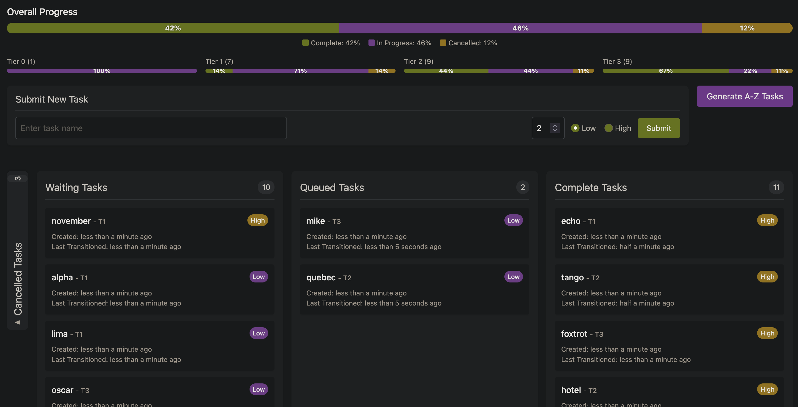

# Multiqueue

A descendent of a similar need as
[patchpal](https://connormccarthy.org/projects/patchpal), muiltiqueue solves the
subsequent problem: allowing for graceful, long bake-time, deployments of
large-scale-changes across a multitude of software projects.

This system allows for arbitrary gating of a central state machine + evaluation
loop, progressing tasks from Waiting to Queued once these configured gates
permit, allowing workers to pick up takss and perform work (progressing states
to Complete). This design was inspired, in part, by a control-loop responsible
for CD within lyft — you can read about this design in Continuous Deployment at
Lyft, written by my colleague Miguel.

The composition of many gates allows for easy creation of complex system
behaviors. For the rollout of large-scale-changes, it can be advantageous to
spread changes out across a few hours or days, providing time for subtle
regressions or bugs to be observed. In a perfect world, these might always be
caught in CI or immediately upon deployment, but I’ve found such cases to be few
and far between. Such regressions may be visible only in specific scenarios, and
so an element of random sampling can be advantageous.

The most powerful abstraction here is that of the good ol’ fashion leaky-bucket
rate limit. Through these rate limits, we can limit the “concurrency” of a
change, dynamically by category of project or time since creation, providing
ample time for reaction without resorting to software rollouts that take weeks.

Multiqueue provides a meaningful proof-of-concept for a system with these
desired properties.

## Development

This project is separated into backend (rust) and frontend (svelte),
communicating with protobufs over HTTP.

To run the backend:

```bash
cd backend/ && cargo run --bin api
```

To run the frontend (and open a browser):

```bash
cd frontend/ && npm run dev -- --open
```
